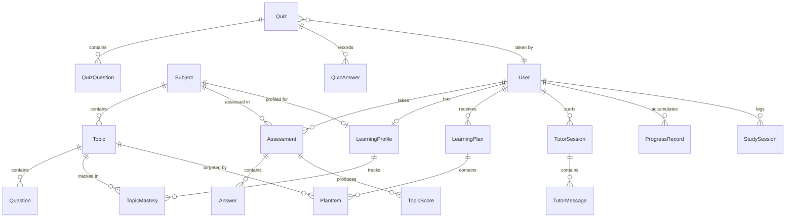

# LearnLoop AI — Database Documentation

**Version:** 1.0
**Status:** Pre-Implementation (Schema Design Phase)

> ⚠️ **Note:** This document describes the planned database schema. No database or Prisma schema has been implemented yet.

---

## Overview

LearnLoop AI uses **PostgreSQL** as its primary database, accessed through **Prisma ORM**. The schema is designed to support the adaptive learning loop — tracking assessments, learning profiles, study plans, tutor sessions, and progress over time.

---

## ER Diagram



---

## Models

### User

**Purpose:** Stores registered user accounts and basic profile information.

| Field | Type | Required | Description |
|---|---|---|---|
| `id` | String (cuid) | Yes | Primary key |
| `email` | String | Yes | Unique email address |
| `password` | String | Yes | Bcrypt hashed password |
| `name` | String | Yes | Display name |
| `educationLevel` | String | No | e.g., "B.Tech CSE - 3rd Year" |
| `learningGoals` | String | No | Free-text learning goals |
| `onboardingCompleted` | Boolean | Yes | Default: false |
| `createdAt` | DateTime | Yes | Auto-generated |
| `updatedAt` | DateTime | Yes | Auto-updated |

**Relationships:**
- Has many `Assessment`
- Has one `LearningProfile` per subject
- Has many `LearningPlan`
- Has many `TutorSession`
- Has many `ProgressRecord`
- Has many `StudySession`

**Indexes:**
- Unique on `email`

**Validation:**
- Email must be valid format
- Password minimum 8 characters (before hashing)
- Name minimum 2 characters

---

### Subject

**Purpose:** Represents an academic subject (e.g., DBMS, OS, Data Structures).

| Field | Type | Required | Description |
|---|---|---|---|
| `id` | String (cuid) | Yes | Primary key |
| `name` | String | Yes | Subject name |
| `description` | String | No | Brief description |
| `icon` | String | No | Icon identifier or emoji |
| `isActive` | Boolean | Yes | Default: true |
| `createdAt` | DateTime | Yes | Auto-generated |

**Relationships:**
- Has many `Topic`
- Has many `Assessment`

**Indexes:**
- Unique on `name`

**Seed Data (Initial):**
- Database Management Systems (DBMS)

---

### Topic

**Purpose:** Represents a specific topic within a subject.

| Field | Type | Required | Description |
|---|---|---|---|
| `id` | String (cuid) | Yes | Primary key |
| `subjectId` | String | Yes | FK → Subject |
| `name` | String | Yes | Topic name |
| `description` | String | No | Brief description |
| `order` | Int | Yes | Display/learning order |
| `difficulty` | String | No | "beginner" / "intermediate" / "advanced" |
| `prerequisites` | String[] | No | IDs of prerequisite topics |
| `createdAt` | DateTime | Yes | Auto-generated |

**Relationships:**
- Belongs to `Subject`
- Has many `Question`

**Indexes:**
- Compound unique on `[subjectId, name]`

**Seed Data (DBMS Topics):**
1. ER Model
2. Relational Model
3. Normalization
4. SQL Queries
5. Transactions
6. Concurrency Control
7. Indexing
8. Query Optimization

---

### Question

**Purpose:** Stores assessment and quiz questions.

| Field | Type | Required | Description |
|---|---|---|---|
| `id` | String (cuid) | Yes | Primary key |
| `topicId` | String | Yes | FK → Topic |
| `text` | String | Yes | Question text |
| `options` | Json | Yes | Array of 4 option strings |
| `correctAnswer` | Int | Yes | 0-indexed correct option |
| `explanation` | String | No | Explanation of correct answer |
| `difficulty` | String | Yes | "easy" / "medium" / "hard" |
| `type` | String | Yes | "assessment" / "practice" |
| `createdAt` | DateTime | Yes | Auto-generated |

**Relationships:**
- Belongs to `Topic`

**Indexes:**
- Index on `topicId`
- Index on `[topicId, difficulty]`

**Validation:**
- `options` must be an array of exactly 4 strings
- `correctAnswer` must be 0, 1, 2, or 3
- `difficulty` must be one of: easy, medium, hard

---

### Assessment

**Purpose:** Represents a complete diagnostic assessment taken by a student.

| Field | Type | Required | Description |
|---|---|---|---|
| `id` | String (cuid) | Yes | Primary key |
| `userId` | String | Yes | FK → User |
| `subjectId` | String | Yes | FK → Subject |
| `totalQuestions` | Int | Yes | Total number of questions |
| `correctAnswers` | Int | Yes | Number of correct answers |
| `overallScore` | Float | Yes | Percentage score (0-100) |
| `timeTakenSeconds` | Int | No | Time spent in seconds |
| `status` | String | Yes | "in_progress" / "completed" / "abandoned" |
| `startedAt` | DateTime | Yes | When assessment started |
| `completedAt` | DateTime | No | When assessment was submitted |
| `createdAt` | DateTime | Yes | Auto-generated |

**Relationships:**
- Belongs to `User`
- Belongs to `Subject`
- Has many `Answer`
- Has many `TopicScore`

**Indexes:**
- Index on `userId`
- Index on `[userId, subjectId]`

---

### Answer

**Purpose:** Records each individual answer in an assessment.

| Field | Type | Required | Description |
|---|---|---|---|
| `id` | String (cuid) | Yes | Primary key |
| `assessmentId` | String | Yes | FK → Assessment |
| `questionId` | String | Yes | FK → Question |
| `selectedOption` | Int | No | 0-indexed selected option (null if unanswered) |
| `isCorrect` | Boolean | Yes | Whether the answer was correct |
| `timeTakenSeconds` | Int | No | Time spent on this question |
| `createdAt` | DateTime | Yes | Auto-generated |

**Relationships:**
- Belongs to `Assessment`
- References `Question`

**Indexes:**
- Index on `assessmentId`
- Compound unique on `[assessmentId, questionId]`

---

### TopicScore

**Purpose:** Stores per-topic scores from an assessment.

| Field | Type | Required | Description |
|---|---|---|---|
| `id` | String (cuid) | Yes | Primary key |
| `assessmentId` | String | Yes | FK → Assessment |
| `topicId` | String | Yes | FK → Topic |
| `totalQuestions` | Int | Yes | Questions for this topic |
| `correctAnswers` | Int | Yes | Correct answers for this topic |
| `percentage` | Float | Yes | Score percentage (0-100) |
| `createdAt` | DateTime | Yes | Auto-generated |

**Relationships:**
- Belongs to `Assessment`
- References `Topic`

**Indexes:**
- Index on `assessmentId`
- Compound unique on `[assessmentId, topicId]`

---

### LearningProfile

**Purpose:** The central data structure for personalization — stores a student's mastery levels, strengths, and weaknesses for a subject.

| Field | Type | Required | Description |
|---|---|---|---|
| `id` | String (cuid) | Yes | Primary key |
| `userId` | String | Yes | FK → User |
| `subjectId` | String | Yes | FK → Subject |
| `overallMastery` | Float | Yes | Overall mastery percentage |
| `strengths` | Json | Yes | Array of strong topic names |
| `weaknesses` | Json | Yes | Array of weak topic names |
| `aiAnalysis` | Json | No | Full AI analysis output |
| `assessmentCount` | Int | Yes | Default: 0 |
| `quizCount` | Int | Yes | Default: 0 |
| `tutorSessionCount` | Int | Yes | Default: 0 |
| `totalStudyMinutes` | Int | Yes | Default: 0 |
| `lastAssessedAt` | DateTime | No | Last assessment timestamp |
| `createdAt` | DateTime | Yes | Auto-generated |
| `updatedAt` | DateTime | Yes | Auto-updated |

**Relationships:**
- Belongs to `User`
- Belongs to `Subject`
- Has many `TopicMastery`

**Indexes:**
- Compound unique on `[userId, subjectId]`

---

### TopicMastery

**Purpose:** Tracks a student's mastery level for each individual topic within a subject.

| Field | Type | Required | Description |
|---|---|---|---|
| `id` | String (cuid) | Yes | Primary key |
| `learningProfileId` | String | Yes | FK → LearningProfile |
| `topicId` | String | Yes | FK → Topic |
| `masteryLevel` | String | Yes | "weak" / "medium" / "strong" |
| `currentScore` | Float | Yes | Latest score percentage |
| `previousScore` | Float | No | Score before last update |
| `trend` | String | Yes | "improving" / "declining" / "stable" / "new" |
| `assessmentCount` | Int | Yes | Times this topic was assessed |
| `lastAssessedAt` | DateTime | No | Last time this topic was scored |
| `createdAt` | DateTime | Yes | Auto-generated |
| `updatedAt` | DateTime | Yes | Auto-updated |

**Relationships:**
- Belongs to `LearningProfile`
- References `Topic`

**Indexes:**
- Index on `learningProfileId`
- Compound unique on `[learningProfileId, topicId]`

---

### LearningPlan

**Purpose:** Stores an AI-generated personalized study plan.

| Field | Type | Required | Description |
|---|---|---|---|
| `id` | String (cuid) | Yes | Primary key |
| `userId` | String | Yes | FK → User |
| `subjectId` | String | Yes | FK → Subject |
| `title` | String | Yes | Plan title |
| `estimatedDuration` | String | No | e.g., "8-10 hours" |
| `status` | String | Yes | "active" / "completed" / "superseded" |
| `aiOutput` | Json | No | Raw AI plan output |
| `createdAt` | DateTime | Yes | Auto-generated |
| `updatedAt` | DateTime | Yes | Auto-updated |

**Relationships:**
- Belongs to `User`
- Has many `PlanItem`

**Indexes:**
- Index on `userId`
- Index on `[userId, status]`

---

### PlanItem

**Purpose:** Individual items within a learning plan.

| Field | Type | Required | Description |
|---|---|---|---|
| `id` | String (cuid) | Yes | Primary key |
| `planId` | String | Yes | FK → LearningPlan |
| `topicId` | String | Yes | FK → Topic |
| `order` | Int | Yes | Sequence in the plan |
| `priority` | String | Yes | "critical" / "high" / "medium" / "low" |
| `estimatedMinutes` | Int | No | Estimated study time |
| `objectives` | Json | No | Array of learning objectives |
| `activities` | Json | No | Array of suggested activities |
| `status` | String | Yes | "pending" / "in_progress" / "completed" |
| `completedAt` | DateTime | No | When this item was completed |
| `createdAt` | DateTime | Yes | Auto-generated |

**Relationships:**
- Belongs to `LearningPlan`
- References `Topic`

**Indexes:**
- Index on `planId`

---

### TutorSession

**Purpose:** Represents an AI tutoring session on a specific topic.

| Field | Type | Required | Description |
|---|---|---|---|
| `id` | String (cuid) | Yes | Primary key |
| `userId` | String | Yes | FK → User |
| `topicId` | String | Yes | FK → Topic |
| `status` | String | Yes | "active" / "completed" |
| `messageCount` | Int | Yes | Default: 0 |
| `startedAt` | DateTime | Yes | Session start time |
| `endedAt` | DateTime | No | Session end time |
| `createdAt` | DateTime | Yes | Auto-generated |

**Relationships:**
- Belongs to `User`
- References `Topic`
- Has many `TutorMessage`

**Indexes:**
- Index on `userId`
- Index on `[userId, topicId]`

---

### TutorMessage

**Purpose:** Individual messages within a tutor session.

| Field | Type | Required | Description |
|---|---|---|---|
| `id` | String (cuid) | Yes | Primary key |
| `sessionId` | String | Yes | FK → TutorSession |
| `role` | String | Yes | "student" / "tutor" |
| `content` | String | Yes | Message content |
| `createdAt` | DateTime | Yes | Auto-generated |

**Relationships:**
- Belongs to `TutorSession`

**Indexes:**
- Index on `sessionId`

---

### Quiz

**Purpose:** Represents an adaptive quiz targeting weak topics.

| Field | Type | Required | Description |
|---|---|---|---|
| `id` | String (cuid) | Yes | Primary key |
| `userId` | String | Yes | FK → User |
| `subjectId` | String | Yes | FK → Subject |
| `targetTopics` | Json | Yes | Array of topic IDs targeted |
| `difficulty` | String | Yes | "easy" / "medium" / "hard" / "mixed" |
| `totalQuestions` | Int | Yes | Number of questions |
| `correctAnswers` | Int | No | Filled after completion |
| `score` | Float | No | Percentage score |
| `status` | String | Yes | "in_progress" / "completed" |
| `aiGenerated` | Boolean | Yes | Whether questions were AI-generated |
| `startedAt` | DateTime | Yes | Quiz start time |
| `completedAt` | DateTime | No | Quiz completion time |
| `createdAt` | DateTime | Yes | Auto-generated |

**Relationships:**
- Belongs to `User`
- Has many `QuizQuestion`
- Has many `QuizAnswer`

**Indexes:**
- Index on `userId`

---

### QuizQuestion

**Purpose:** Stores questions for an adaptive quiz (may be AI-generated).

| Field | Type | Required | Description |
|---|---|---|---|
| `id` | String (cuid) | Yes | Primary key |
| `quizId` | String | Yes | FK → Quiz |
| `topicId` | String | Yes | FK → Topic |
| `text` | String | Yes | Question text |
| `options` | Json | Yes | Array of 4 option strings |
| `correctAnswer` | Int | Yes | 0-indexed correct option |
| `explanation` | String | No | Explanation |
| `difficulty` | String | Yes | "easy" / "medium" / "hard" |
| `order` | Int | Yes | Question sequence |
| `createdAt` | DateTime | Yes | Auto-generated |

**Relationships:**
- Belongs to `Quiz`

**Indexes:**
- Index on `quizId`

---

### QuizAnswer

**Purpose:** Records student answers on quizzes.

| Field | Type | Required | Description |
|---|---|---|---|
| `id` | String (cuid) | Yes | Primary key |
| `quizId` | String | Yes | FK → Quiz |
| `questionId` | String | Yes | FK → QuizQuestion |
| `selectedOption` | Int | No | 0-indexed selected option |
| `isCorrect` | Boolean | Yes | Whether correct |
| `createdAt` | DateTime | Yes | Auto-generated |

**Relationships:**
- Belongs to `Quiz`
- References `QuizQuestion`

**Indexes:**
- Index on `quizId`

---

### StudySession

**Purpose:** Logs time spent studying (for analytics).

| Field | Type | Required | Description |
|---|---|---|---|
| `id` | String (cuid) | Yes | Primary key |
| `userId` | String | Yes | FK → User |
| `type` | String | Yes | "assessment" / "tutor" / "quiz" / "review" |
| `referenceId` | String | No | ID of related record |
| `durationMinutes` | Int | Yes | Time spent |
| `createdAt` | DateTime | Yes | Auto-generated |

**Relationships:**
- Belongs to `User`

**Indexes:**
- Index on `userId`
- Index on `[userId, type]`

---

### ProgressRecord

**Purpose:** Snapshots of learning profile state over time (for trend tracking).

| Field | Type | Required | Description |
|---|---|---|---|
| `id` | String (cuid) | Yes | Primary key |
| `userId` | String | Yes | FK → User |
| `subjectId` | String | Yes | FK → Subject |
| `overallMastery` | Float | Yes | Mastery at this point |
| `topicScores` | Json | Yes | Snapshot of all topic scores |
| `trigger` | String | Yes | "assessment" / "quiz" / "tutor_session" |
| `triggerId` | String | No | ID of triggering event |
| `createdAt` | DateTime | Yes | Auto-generated |

**Relationships:**
- Belongs to `User`

**Indexes:**
- Index on `[userId, subjectId]`
- Index on `createdAt`

---

## Prisma Schema (Planned)

The complete Prisma schema will be located at `prisma/schema.prisma`.

### Database Connection

```prisma
datasource db {
  provider = "postgresql"
  url      = env("DATABASE_URL")
}

generator client {
  provider = "prisma-client-js"
}
```

---

## Seed Data Strategy

The seed script (`prisma/seed.ts`) will populate:

1. **Subjects:** DBMS (initial subject)
2. **Topics:** 6-8 topics per subject with descriptions and ordering
3. **Questions:** 5-10 questions per topic for the diagnostic assessment

Seed data is essential for the demo — without it, there are no subjects, topics, or assessment questions.

---

## Migration Strategy

- Use `npx prisma db push` during development (quick iteration)
- Use `npx prisma migrate dev` for tracked migrations before production
- Always run `npx prisma generate` after schema changes
