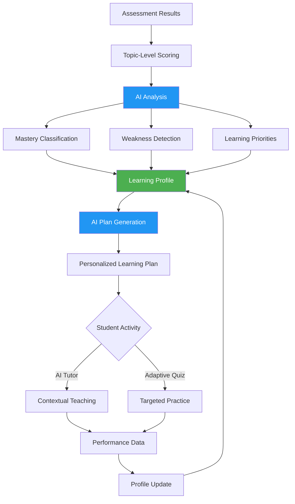
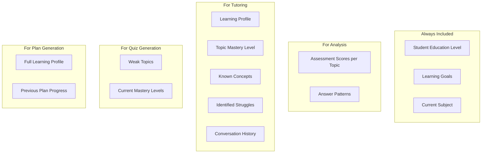
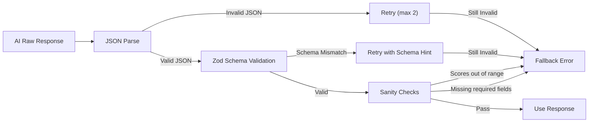

# SkillSync AI — AI Workflow Documentation

**Version:** 1.0
**Status:** Pre-Implementation (Design Phase)

> ⚠️ **Note:** This document describes the planned AI workflow. No AI integration has been implemented yet. All examples represent the target design.

---

## Overview

SkillSync AI uses Google Gemini as the core AI engine. The AI is **not** a generic chatbot — it is a specialized educational analysis and tutoring system that operates within a structured, validated pipeline.

**Core Principle:** Every AI interaction receives student context and produces validated, structured output. Raw LLM output is never trusted or displayed directly.

---

## AI Responsibilities

| Responsibility | Input | Output | Frequency |
|---|---|---|---|
| **Learning Analysis** | Assessment scores per topic | Mastery classification + weakness reasoning | After each assessment |
| **Plan Generation** | Learning profile + weaknesses | Prioritized study plan | After profile changes |
| **Contextual Tutoring** | Topic + student profile + chat history | Educational explanation | On-demand |
| **Quiz Generation** | Weak topics + mastery levels | Difficulty-appropriate questions | On-demand |
| **Progress Analysis** | Historical performance data | Trend analysis + recommendations | After quiz/activity |

---

## The Adaptive Learning Loop



**The loop never ends.** Every activity produces new performance data, which updates the profile, which changes the next recommendation.

---

## Inputs

### What the AI Receives

Every AI request includes **student context**. The AI never operates in a vacuum.

#### For Learning Analysis

```json
{
  "studentId": "student_123",
  "subjectName": "Database Management Systems",
  "assessmentResults": {
    "overallScore": 55,
    "totalQuestions": 30,
    "correctAnswers": 16,
    "topicScores": [
      { "topicName": "ER Model", "correct": 4, "total": 5, "percentage": 80 },
      { "topicName": "Normalization", "correct": 1, "total": 5, "percentage": 20 },
      { "topicName": "SQL Queries", "correct": 3, "total": 5, "percentage": 60 },
      { "topicName": "Transactions", "correct": 2, "total": 5, "percentage": 40 },
      { "topicName": "Indexing", "correct": 4, "total": 5, "percentage": 80 },
      { "topicName": "Concurrency Control", "correct": 2, "total": 5, "percentage": 40 }
    ]
  },
  "studentProfile": {
    "educationLevel": "B.Tech CSE - 3rd Year",
    "learningGoals": "Pass DBMS exam with 70%+"
  }
}
```

#### For AI Tutor

```json
{
  "topic": "Normalization",
  "studentProfile": {
    "masteryLevel": "weak",
    "score": 20,
    "previousAttempts": 1,
    "knownConcepts": ["1NF basics"],
    "struggles": ["Identifying partial dependencies", "3NF vs BCNF"]
  },
  "conversationHistory": [
    { "role": "student", "content": "I don't understand 2NF" },
    { "role": "tutor", "content": "Let me explain with an example..." }
  ],
  "educationLevel": "B.Tech CSE - 3rd Year"
}
```

#### For Adaptive Quiz

```json
{
  "weakTopics": [
    { "topicName": "Normalization", "mastery": 20 },
    { "topicName": "Transactions", "mastery": 40 }
  ],
  "difficultyTarget": "easy-to-medium",
  "questionCount": 5,
  "subjectName": "Database Management Systems"
}
```

---

## Outputs

### What the AI Returns

All AI outputs are **structured JSON** validated against Zod schemas before use.

#### Learning Analysis Output

```json
{
  "overallAssessment": "The student has a foundational understanding of DBMS but significant gaps in core areas like Normalization and Concurrency Control that will impact advanced topics.",
  "topicMastery": [
    {
      "topicName": "ER Model",
      "masteryLevel": "strong",
      "score": 80,
      "reasoning": "Student correctly answered 4/5 questions including complex ER diagram interpretation."
    },
    {
      "topicName": "Normalization",
      "masteryLevel": "weak",
      "score": 20,
      "reasoning": "Student only answered 1/5 correctly. Errors suggest confusion between 2NF and 3NF, and inability to identify functional dependencies."
    },
    {
      "topicName": "SQL Queries",
      "masteryLevel": "medium",
      "score": 60,
      "reasoning": "Basic SELECT and WHERE understood, but struggled with JOIN operations and subqueries."
    },
    {
      "topicName": "Transactions",
      "masteryLevel": "weak",
      "score": 40,
      "reasoning": "Understands ACID concept but cannot apply isolation levels or identify anomalies."
    },
    {
      "topicName": "Indexing",
      "masteryLevel": "strong",
      "score": 80,
      "reasoning": "Good understanding of B-tree indexing and when to use indexes."
    },
    {
      "topicName": "Concurrency Control",
      "masteryLevel": "weak",
      "score": 40,
      "reasoning": "Confused between lock-based and timestamp-based protocols."
    }
  ],
  "weaknesses": [
    {
      "topicName": "Normalization",
      "priority": 1,
      "reason": "Foundational topic — weakness here affects understanding of database design."
    },
    {
      "topicName": "Transactions",
      "priority": 2,
      "reason": "Core concept needed for understanding concurrency control."
    },
    {
      "topicName": "Concurrency Control",
      "priority": 3,
      "reason": "Depends on transaction understanding — should be addressed after Transactions."
    }
  ],
  "recommendations": [
    "Start with Normalization — focus on functional dependencies and normal forms (1NF through BCNF).",
    "Then move to Transactions — focus on isolation levels and anomalies with examples.",
    "Finally address Concurrency Control after Transactions are solid."
  ],
  "confidence": 0.85
}
```

#### Personalized Plan Output

```json
{
  "planTitle": "DBMS Recovery Plan — Focus on Normalization & Transactions",
  "estimatedDuration": "8-10 hours",
  "items": [
    {
      "order": 1,
      "topicName": "Normalization",
      "priority": "critical",
      "estimatedMinutes": 180,
      "objectives": [
        "Understand functional dependencies",
        "Identify 1NF, 2NF, 3NF violations",
        "Apply normalization to a sample schema"
      ],
      "activities": [
        "AI Tutor session on functional dependencies",
        "Practice quiz: Identifying normal form violations",
        "AI Tutor session on 2NF → 3NF → BCNF progression"
      ]
    },
    {
      "order": 2,
      "topicName": "Transactions",
      "priority": "high",
      "estimatedMinutes": 120,
      "objectives": [
        "Explain ACID properties with examples",
        "Identify transaction anomalies",
        "Apply correct isolation levels"
      ],
      "activities": [
        "AI Tutor session on ACID deep-dive",
        "Practice quiz: Transaction anomalies"
      ]
    },
    {
      "order": 3,
      "topicName": "Concurrency Control",
      "priority": "medium",
      "estimatedMinutes": 120,
      "objectives": [
        "Understand lock-based protocols",
        "Distinguish timestamp-based from lock-based",
        "Detect and resolve deadlocks"
      ],
      "activities": [
        "AI Tutor session on concurrency protocols",
        "Practice quiz: Concurrency scenarios"
      ]
    }
  ]
}
```

#### Adaptive Quiz Output

```json
{
  "quizTitle": "Normalization Practice",
  "targetTopic": "Normalization",
  "difficulty": "easy-to-medium",
  "questions": [
    {
      "id": "q1",
      "question": "Which of the following is a requirement for a relation to be in 2NF?",
      "options": [
        "All attributes must be atomic",
        "No partial dependencies on the primary key",
        "No transitive dependencies",
        "All attributes must be functionally dependent on the entire key"
      ],
      "correctAnswer": 1,
      "explanation": "2NF requires that no non-prime attribute is partially dependent on any candidate key. This means every non-key attribute must depend on the whole primary key, not just part of it.",
      "difficulty": "easy",
      "topic": "Normalization"
    }
  ]
}
```

---

## Prompt Strategy

### Prompt Structure

Every prompt follows a four-part structure:

```
┌─────────────────────────────────┐
│ SYSTEM: Role + Output Rules     │
├─────────────────────────────────┤
│ CONTEXT: Student Profile + Data │
├─────────────────────────────────┤
│ TASK: Specific Instruction      │
├─────────────────────────────────┤
│ FORMAT: Required JSON Schema    │
└─────────────────────────────────┘
```

### Example: Learning Analysis Prompt

```text
SYSTEM:
You are an expert educational AI that analyzes student assessment results
to identify learning gaps and create personalized improvement strategies.

You MUST respond in valid JSON matching the schema provided.
Do NOT include any text outside the JSON.
Do NOT invent or assume any data not provided.
Base your analysis ONLY on the scores given.

CONTEXT:
Student: B.Tech CSE, 3rd Year
Subject: Database Management Systems
Learning Goal: Pass DBMS exam with 70%+

Assessment Results:
- ER Model: 80% (4/5 correct)
- Normalization: 20% (1/5 correct)
- SQL Queries: 60% (3/5 correct)
- Transactions: 40% (2/5 correct)
- Indexing: 80% (4/5 correct)
- Concurrency Control: 40% (2/5 correct)

TASK:
Analyze the assessment results and produce:
1. A mastery classification for each topic (weak/medium/strong)
2. Specific reasoning for each classification
3. Ordered list of weaknesses with priority and justification
4. Actionable recommendations

SCHEMA:
{
  "overallAssessment": "string — 1-2 sentence summary",
  "topicMastery": [
    {
      "topicName": "string",
      "masteryLevel": "weak | medium | strong",
      "score": "number",
      "reasoning": "string — explain why this classification"
    }
  ],
  "weaknesses": [
    {
      "topicName": "string",
      "priority": "number — 1 is highest",
      "reason": "string — why this should be prioritized"
    }
  ],
  "recommendations": ["string — actionable next steps"],
  "confidence": "number — 0 to 1"
}
```

### Example: AI Tutor Prompt

```text
SYSTEM:
You are a patient, knowledgeable DBMS tutor. You teach concepts
through clear explanations and relatable examples.

Rules:
- Teach, don't just answer. Explain the "why" behind concepts.
- Use the student's education level to calibrate complexity.
- Reference their known concepts and struggles.
- Use examples relevant to their course.
- Break complex topics into steps.
- Ask checking questions to verify understanding.
- Do NOT simply provide direct answers to homework-style questions.

CONTEXT:
Student Profile:
- Level: B.Tech CSE, 3rd Year
- Topic: Normalization
- Current Mastery: Weak (20%)
- Known Concepts: 1NF basics
- Struggles With: Identifying partial dependencies, 3NF vs BCNF
- Previous Attempts: 1

Conversation History:
[Student]: I don't understand 2NF
[Tutor]: Let me explain with an example...

TASK:
Continue the tutoring conversation. Address the student's question or
build on the previous explanation. Focus on building understanding
step by step.
```

### Example: Adaptive Quiz Prompt

```text
SYSTEM:
You are an educational quiz generator. Create multiple-choice questions
that test understanding, not just memorization.

Rules:
- Questions must be about the specified topics.
- Match difficulty to the student's current mastery level.
- Each question must have exactly 4 options with 1 correct answer.
- Include a clear explanation for the correct answer.
- Distractors should represent common misconceptions.
- Output must be valid JSON matching the schema.

CONTEXT:
Weak Topics:
- Normalization (mastery: 20%)
- Transactions (mastery: 40%)

Target Difficulty: easy-to-medium (student is currently weak)

TASK:
Generate 5 multiple-choice questions focusing on the weak topics.
Prioritize Normalization (3 questions) over Transactions (2 questions).

SCHEMA:
{
  "questions": [
    {
      "id": "string",
      "question": "string",
      "options": ["string", "string", "string", "string"],
      "correctAnswer": "number — 0-indexed",
      "explanation": "string",
      "difficulty": "easy | medium | hard",
      "topic": "string"
    }
  ]
}
```

---

## Context Management

### What Context is Sent to AI

The AI receives student context with every request. This is what makes SkillSync AI different from a generic chatbot.



### Context Window Management

- **Tutor sessions:** Include the last 10 messages of conversation history (to stay within token limits)
- **Analysis:** Include full assessment results (typically small)
- **Quiz:** Include topic-level mastery (compact summary)
- **Plan:** Include full learning profile (moderate size)

---

## Student Learning Profile

### Profile Structure

The learning profile is the central data structure that drives all personalization.

```json
{
  "userId": "student_123",
  "subjectId": "dbms_001",
  "overallMastery": 55,
  "topicMastery": [
    {
      "topicId": "topic_001",
      "topicName": "Normalization",
      "masteryLevel": "weak",
      "currentScore": 20,
      "previousScore": null,
      "trend": "new",
      "assessmentCount": 1,
      "lastAssessed": "2026-09-24T10:00:00Z"
    }
  ],
  "strengths": ["ER Model", "Indexing"],
  "weaknesses": ["Normalization", "Transactions", "Concurrency Control"],
  "learningStyle": null,
  "totalStudyTime": 0,
  "assessmentsTaken": 1,
  "quizzesTaken": 0,
  "tutorSessionsCompleted": 0,
  "lastUpdated": "2026-09-24T10:00:00Z"
}
```

### Profile Update Rules

| Event | What Updates |
|---|---|
| Assessment completed | Topic scores, mastery levels, strengths/weaknesses |
| Quiz completed | Topic scores for quiz topics, trends |
| Tutor session ended | Study time, session count |
| Plan item completed | Plan progress |

### Mastery Thresholds

| Level | Score Range | Color | Action |
|---|---|---|---|
| Weak | 0% – 40% | Red | Priority focus, AI tutoring recommended |
| Medium | 41% – 70% | Yellow | Practice recommended |
| Strong | 71% – 100% | Green | Maintenance, move to next topic |

---

## Weakness Detection

### Detection Algorithm

```
1. Score each topic based on correct/total answers
2. Classify mastery: weak (≤40%), medium (41-70%), strong (>70%)
3. Sort weak topics by:
   a. Score (lowest first)
   b. Topic importance (foundational topics first)
   c. Prerequisites (teach prerequisites before dependent topics)
4. Generate prioritized weakness list
```

### Prerequisite Awareness

Some topics depend on others. The AI should recommend studying prerequisites first:

```
Normalization → depends on: Relational Model basics
Concurrency Control → depends on: Transactions
Query Optimization → depends on: SQL Queries, Indexing
```

---

## Recommendation Generation

### Recommendation Types

1. **Study Recommendation:** "Focus on Normalization — start with functional dependencies"
2. **Activity Recommendation:** "Take a practice quiz on Transactions"
3. **Review Recommendation:** "Revisit ER Model to reinforce fundamentals"
4. **Progress Recommendation:** "You've improved in Normalization — move to 3NF"

### Recommendation Priority

```
Priority 1: Critical weaknesses (score ≤ 20%)
Priority 2: Weak topics (score 21-40%)
Priority 3: Medium topics needing improvement (score 41-60%)
Priority 4: Medium topics close to strong (score 61-70%)
Priority 5: Maintenance of strong topics (score > 70%)
```

---

## AI Output Validation

### Validation Pipeline



### Validation Rules

```typescript
// Example Zod schema for learning analysis
const AnalysisSchema = z.object({
  overallAssessment: z.string().min(10).max(500),
  topicMastery: z.array(z.object({
    topicName: z.string(),
    masteryLevel: z.enum(["weak", "medium", "strong"]),
    score: z.number().min(0).max(100),
    reasoning: z.string().min(10).max(300),
  })).min(1),
  weaknesses: z.array(z.object({
    topicName: z.string(),
    priority: z.number().int().positive(),
    reason: z.string().min(10),
  })),
  recommendations: z.array(z.string()).min(1).max(5),
  confidence: z.number().min(0).max(1),
});
```

### Sanity Checks

Beyond schema validation, apply domain-specific sanity checks:

- Topic scores must match actual assessment data (± rounding)
- Number of topics in analysis must match number of topics assessed
- Weak topics must have scores ≤ 40%
- Strong topics must have scores > 70%
- Priority numbers must be unique and sequential
- Confidence score must be reasonable (not always 1.0)

---

## Failure Handling

### Failure Modes

| Failure | Detection | Response |
|---|---|---|
| API timeout | Request exceeds 15s | Show "AI is taking longer than expected. Please try again." |
| Invalid JSON response | JSON.parse fails | Retry once. If still fails, show error. |
| Schema validation failure | Zod validation fails | Retry with explicit schema hint. If fails, show error. |
| Sanity check failure | Domain checks fail | Log issue, show partial results with warning. |
| Rate limit exceeded | 429 response | Queue request, show "AI is busy. Retrying..." |
| API key invalid | 401/403 response | Log critical error, show "Service unavailable." |
| Empty response | Empty or null body | Retry once, then show error. |

### Retry Strategy

```
Attempt 1: Normal request
Attempt 2: Request with explicit "Please respond in valid JSON only" appended
Attempt 3 (tutor only): Simplified prompt with fewer constraints
After 3 failures: Show user-friendly error with retry button
```

### Fallback Behavior

If AI analysis completely fails:

1. Store raw assessment scores without AI classification
2. Use simple threshold-based classification (score-based, no reasoning)
3. Display scores to the student with a note: "AI analysis temporarily unavailable"
4. Queue a retry for the next page load

---

## Hallucination Prevention

### Rules

1. **Never let AI invent scores.** Assessment scores come from the database, not AI.
2. **Never let AI claim a student did something they didn't.** Cross-reference with stored data.
3. **Always include actual data in the prompt.** AI classifies data it receives, not data it imagines.
4. **Validate output against input.** If AI returns a topic not in the assessment, reject it.
5. **Don't let AI reference external resources** unless they are curated and verified.

### Validation Example

```typescript
function validateAnalysisAgainstAssessment(
  analysis: AnalysisOutput,
  assessment: AssessmentData
): boolean {
  const assessedTopics = assessment.topicScores.map(t => t.topicName);
  const analyzedTopics = analysis.topicMastery.map(t => t.topicName);

  // Every analyzed topic must exist in the assessment
  for (const topic of analyzedTopics) {
    if (!assessedTopics.includes(topic)) {
      console.error(`AI hallucinated topic: ${topic}`);
      return false;
    }
  }

  // Scores should approximately match
  for (const mastery of analysis.topicMastery) {
    const assessedScore = assessment.topicScores
      .find(t => t.topicName === mastery.topicName)?.percentage;
    if (assessedScore !== undefined && Math.abs(mastery.score - assessedScore) > 5) {
      console.error(`AI altered score for ${mastery.topicName}: ${mastery.score} vs ${assessedScore}`);
      return false;
    }
  }

  return true;
}
```

---

## Explainability

### Why This Matters

Students need to understand **why** the AI recommends what it recommends. "Study Normalization" is not enough — the student needs to know "because you scored 20% on Normalization, specifically struggling with partial dependencies."

### Explainability Requirements

1. Every weakness must include a `reason` field.
2. Every mastery classification must include `reasoning`.
3. Every plan item must include `objectives` that explain what will be learned.
4. The AI tutor must explain concepts, not just state facts.
5. Quiz explanations must explain why the correct answer is correct and why common wrong answers are wrong.

---

## Confidence Handling

### AI Confidence Score

The AI returns a `confidence` score (0–1) with analysis results.

| Confidence | Meaning | Action |
|---|---|---|
| 0.8 – 1.0 | High confidence | Display results normally |
| 0.6 – 0.79 | Moderate confidence | Display results with "Based on limited data" note |
| Below 0.6 | Low confidence | Display basic scores, suggest retaking assessment |

### When Confidence is Low

- Assessment had very few questions per topic (< 3)
- Many questions were unanswered
- Scores were borderline (close to threshold boundaries)
- Time spent was unusually short (possible guessing)

---

## AI Service Implementation Plan

### Service Architecture

```typescript
// Planned service structure
// src/lib/ai/

// gemini.ts — Gemini API client wrapper
// prompts.ts — All prompt templates
// validators.ts — Zod schemas for AI output
// analysis.ts — Learning analysis service
// tutor.ts — AI tutor service
// quiz.ts — Adaptive quiz service
// plan.ts — Plan generation service
```

### Service Interface (Planned)

```typescript
interface AIService {
  analyzeLearning(input: AnalysisInput): Promise<AnalysisOutput>;
  generatePlan(input: PlanInput): Promise<PlanOutput>;
  tutorRespond(input: TutorInput): Promise<TutorOutput>;
  generateQuiz(input: QuizInput): Promise<QuizOutput>;
  analyzeProgress(input: ProgressInput): Promise<ProgressOutput>;
}
```

---

## Token Usage Considerations

### Estimated Token Usage per Operation

| Operation | Input Tokens | Output Tokens | Cost Estimate (Gemini Flash) |
|---|---|---|---|
| Learning Analysis | ~500 | ~800 | ~$0.0003 |
| Plan Generation | ~600 | ~600 | ~$0.0003 |
| Tutor Message | ~400 | ~300 | ~$0.0002 |
| Quiz Generation (5Q) | ~300 | ~1000 | ~$0.0003 |

### Cost Management

- Use `gemini-1.5-flash` for all operations (fast, cheap)
- Consider `gemini-1.5-pro` only for complex analysis if flash quality is insufficient
- Cache learning profiles to avoid re-fetching
- Limit tutor conversation history to 10 messages
- Set max output tokens per request type
