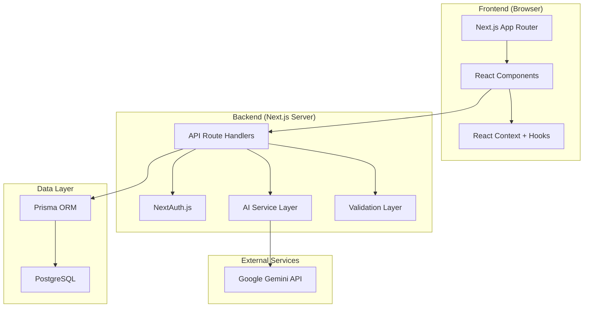
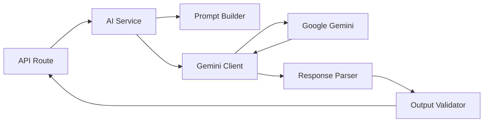
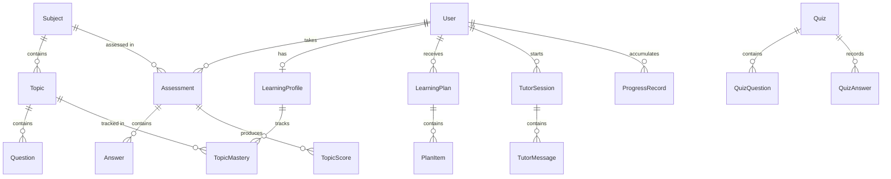
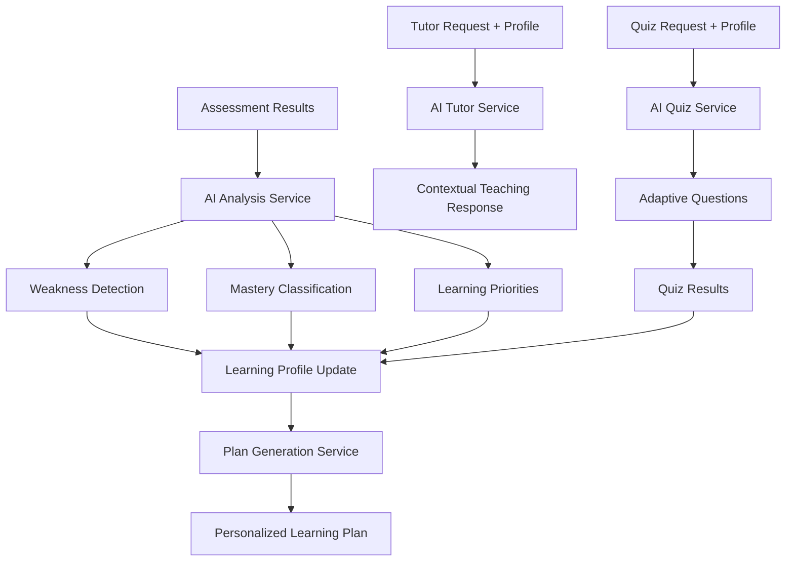
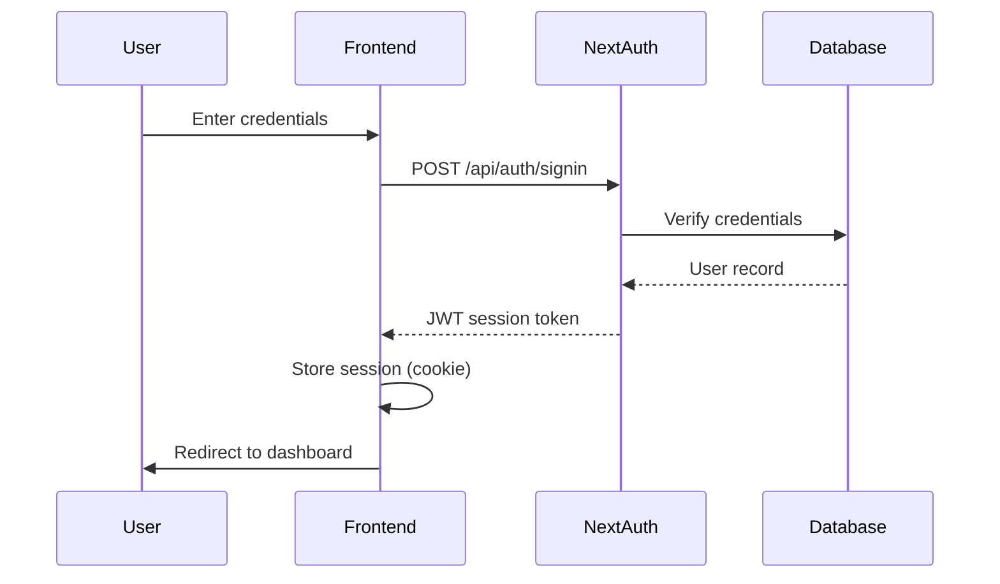
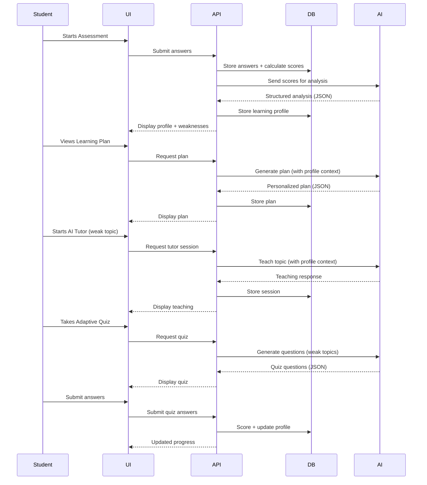
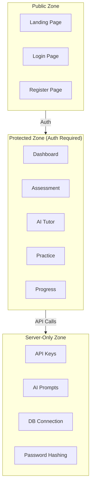
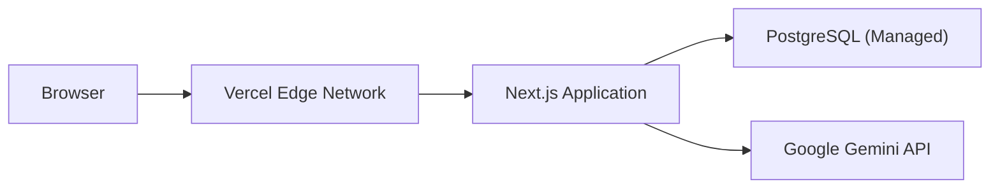

# SkillSync AI — Technical Architecture

**Version:** 1.0
**Status:** Pre-Implementation (Design Phase)

> ⚠️ **Note:** This document describes the planned architecture. No code has been implemented yet. All diagrams and descriptions represent the target design.

---

## System Overview

SkillSync AI is a full-stack web application built with Next.js 14 (App Router), PostgreSQL, and Google Gemini AI. The system follows a monolithic architecture suitable for a hackathon timeline, with clear separation between UI, API, database, and AI layers.



---

## Frontend Architecture

### Technology

- **Framework:** Next.js 14 with App Router
- **Language:** TypeScript
- **Styling:** Tailwind CSS
- **Charts:** Recharts
- **State:** React Context + custom hooks

### Directory Structure (Planned)

```
src/
├── app/                        # Next.js App Router
│   ├── layout.tsx              # Root layout
│   ├── page.tsx                # Landing page
│   ├── (auth)/                 # Auth route group
│   │   ├── login/page.tsx
│   │   └── register/page.tsx
│   ├── (dashboard)/            # Protected route group
│   │   ├── layout.tsx          # Dashboard layout with sidebar
│   │   ├── dashboard/page.tsx  # Main dashboard
│   │   ├── onboarding/page.tsx
│   │   ├── assessment/page.tsx
│   │   ├── tutor/page.tsx
│   │   ├── practice/page.tsx
│   │   └── progress/page.tsx
│   └── api/                    # API routes
│       ├── auth/[...nextauth]/route.ts
│       ├── users/
│       ├── subjects/
│       ├── assessment/
│       ├── analysis/
│       ├── learning-plan/
│       ├── tutor/
│       ├── quiz/
│       └── progress/
├── components/                 # Reusable components
│   ├── ui/                     # Base UI components
│   ├── assessment/             # Assessment-specific components
│   ├── dashboard/              # Dashboard components
│   ├── tutor/                  # Tutor components
│   └── charts/                 # Chart components
├── lib/                        # Utilities and services
│   ├── prisma.ts               # Prisma client singleton
│   ├── ai/                     # AI service layer
│   │   ├── gemini.ts           # Gemini API client
│   │   ├── prompts.ts          # Prompt templates
│   │   └── validators.ts      # AI output validators
│   ├── auth.ts                 # Auth configuration
│   └── utils.ts                # General utilities
├── contexts/                   # React contexts
├── hooks/                      # Custom hooks
├── types/                      # TypeScript types
└── styles/                     # Global styles
```

### Page Architecture

| Page | Route | Auth Required | Key Components |
|---|---|---|---|
| Landing | `/` | No | Hero, Features, CTA |
| Login | `/login` | No | LoginForm |
| Register | `/register` | No | RegisterForm |
| Onboarding | `/onboarding` | Yes | OnboardingWizard |
| Assessment | `/assessment` | Yes | QuestionCard, Timer, ProgressBar |
| Dashboard | `/dashboard` | Yes | ProfileCard, PlanView, RecommendationCards |
| AI Tutor | `/tutor` | Yes | ChatInterface, TopicSelector |
| Practice | `/practice` | Yes | QuizCard, ResultsSummary |
| Progress | `/progress` | Yes | MasteryChart, TimelineChart, TopicGrid |

### Client-Side State Management

```
AuthContext          → User session, auth state
LearningContext      → Current learning profile, active plan
AssessmentContext     → Active assessment state, answers, timer
TutorContext         → Active tutor session, message history
```

---

## Backend Architecture

### API Layer

All API routes use Next.js Route Handlers (`app/api/*/route.ts`). Each route handler:

1. Validates the session (via NextAuth)
2. Validates the request body (via Zod schemas)
3. Executes business logic
4. Returns a structured JSON response

### API Middleware Pattern

```typescript
// Conceptual pattern for each route handler
export async function POST(request: Request) {
  // 1. Authenticate
  const session = await getServerSession(authOptions);
  if (!session) return Response.json({ error: "Unauthorized" }, { status: 401 });

  // 2. Validate input
  const body = await request.json();
  const parsed = schema.safeParse(body);
  if (!parsed.success) return Response.json({ error: parsed.error }, { status: 400 });

  // 3. Execute business logic
  try {
    const result = await businessLogic(parsed.data);
    return Response.json(result);
  } catch (error) {
    return Response.json({ error: "Internal error" }, { status: 500 });
  }
}
```

### AI Service Layer

The AI service layer sits between the API routes and the Gemini API. It is responsible for:

1. **Prompt Construction** — Building prompts with student context
2. **API Communication** — Sending requests to Gemini
3. **Response Parsing** — Extracting structured data from AI responses
4. **Validation** — Ensuring AI output matches expected schema
5. **Error Handling** — Graceful fallback on AI failures



---

## Database Architecture

### Technology

- **Database:** PostgreSQL 15+
- **ORM:** Prisma
- **Connection:** Connection pooling via Prisma

### Core Tables



See [DATABASE.md](DATABASE.md) for complete schema documentation.

---

## AI Architecture

### AI Provider

- **Service:** Google Gemini API (gemini-1.5-flash or gemini-1.5-pro)
- **Communication:** REST API via `@google/generative-ai` SDK
- **Output Format:** Structured JSON (validated server-side)

### AI Responsibilities



### Prompt Strategy

All AI prompts follow this structure:

```
SYSTEM: Role definition + output format requirements
CONTEXT: Student learning profile + relevant history
TASK: Specific instruction with constraints
FORMAT: Required JSON schema for output
```

### AI Safety

- AI output is **never** displayed raw to the user
- All structured output is validated against Zod schemas
- AI failures produce graceful error states, not crashes
- API keys are server-side only (`process.env`)
- Prompts are not exposed to the client

See [AI_WORKFLOW.md](AI_WORKFLOW.md) for detailed AI workflow documentation.

---

## Authentication Architecture

### Technology

- **Provider:** NextAuth.js v4
- **Strategy:** Credentials provider (email + password)
- **Session:** JWT-based session tokens
- **Password:** bcrypt hashing

### Auth Flow



### Protected Routes

All routes under `/(dashboard)/*` require authentication. Unauthenticated requests are redirected to `/login`.

---

## API Architecture

### Route Structure

```
/api/auth/[...nextauth]     → NextAuth handlers
/api/users/                 → User profile operations
/api/subjects/              → Subject and topic listing
/api/assessment/            → Assessment CRUD and submission
/api/analysis/              → AI learning analysis
/api/learning-plan/         → Learning plan generation and retrieval
/api/tutor/                 → AI tutor sessions and messages
/api/quiz/                  → Adaptive quiz generation and scoring
/api/progress/              → Progress tracking and history
```

See [API.md](API.md) for complete API documentation.

---

## Data Flow

### Complete Adaptive Learning Loop



---

## Error Handling

### Error Strategy

| Layer | Strategy |
|---|---|
| Frontend | Error boundaries, toast notifications, retry buttons |
| API | Structured error responses with HTTP status codes |
| Database | Prisma error mapping to user-friendly messages |
| AI | Timeout handling, fallback messages, retry logic |

### Error Response Format

```json
{
  "error": {
    "code": "ASSESSMENT_NOT_FOUND",
    "message": "The requested assessment does not exist.",
    "status": 404
  }
}
```

---

## Security Boundaries



---

## External Services

| Service | Purpose | Authentication |
|---|---|---|
| Google Gemini API | AI analysis, tutoring, quiz generation | API Key (server-side) |
| PostgreSQL | Data persistence | Connection string (server-side) |
| Vercel (planned) | Deployment hosting | Platform auth |

---

## Deployment Architecture (Planned)



### Deployment Targets

- **Application:** Vercel (serverless functions)
- **Database:** Vercel Postgres, Supabase, or Neon
- **Environment:** Environment variables via Vercel dashboard

---

## Architecture Gaps

Since this is a greenfield project, the following represent design decisions that need to be finalized during implementation:

| Area | Gap | Decision Needed |
|---|---|---|
| Caching | No caching strategy defined | Decide if/where to cache AI responses |
| Rate Limiting | No rate limiting implemented | Decide on API rate limiting approach |
| File Storage | No file storage needed for MVP | Confirm no file upload requirements |
| WebSockets | Not planned for MVP | Decide if real-time features are needed |
| Background Jobs | No job queue planned | Decide if AI analysis should be async |
| Logging | No structured logging planned | Choose a logging approach |
