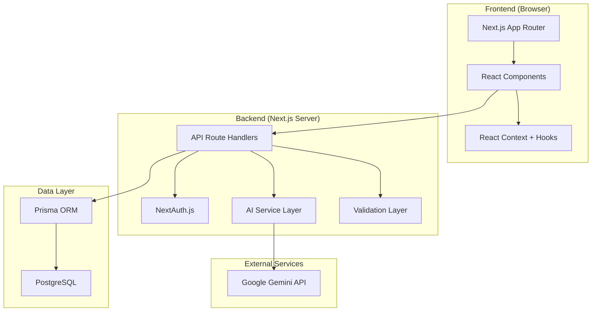
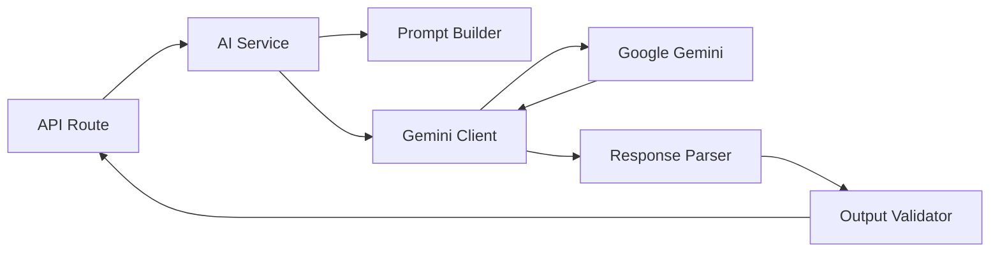
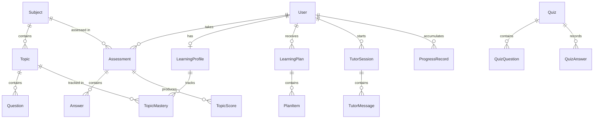
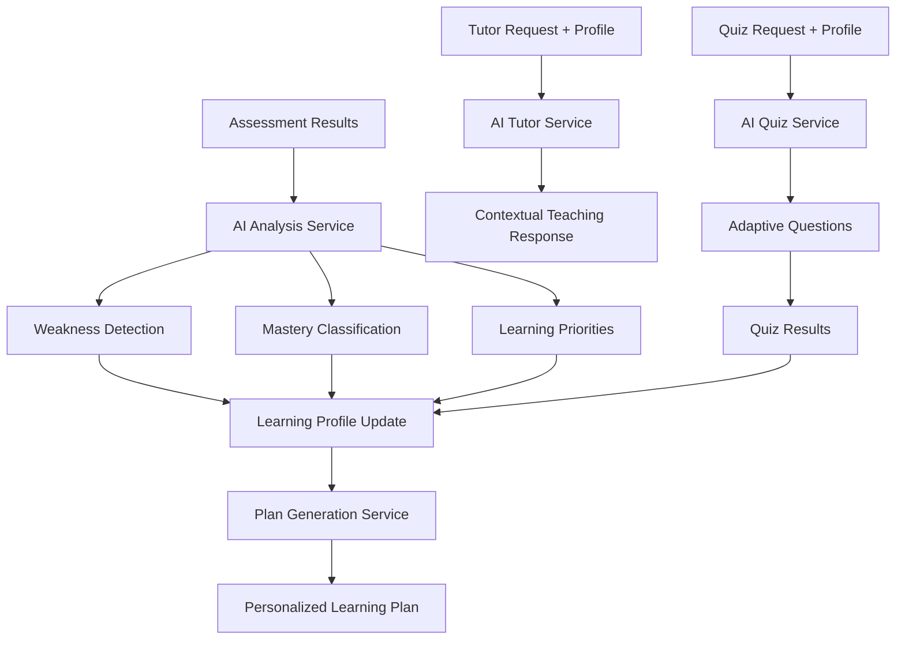
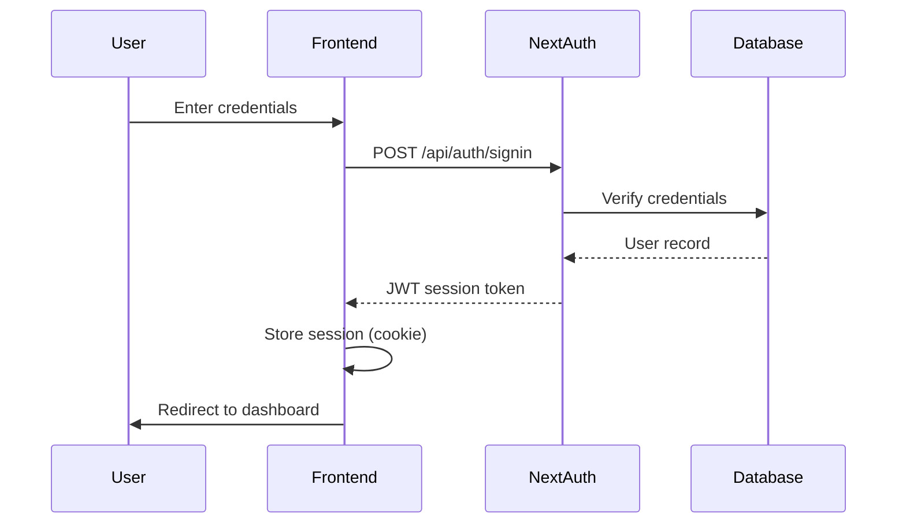
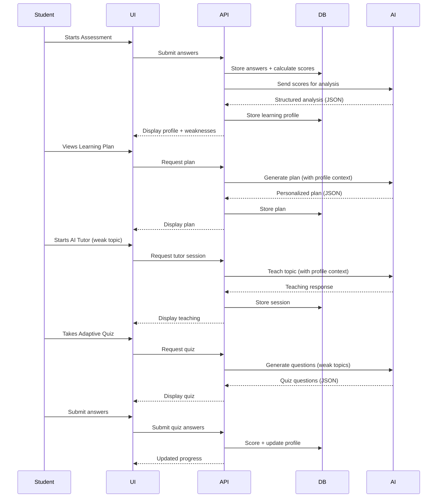
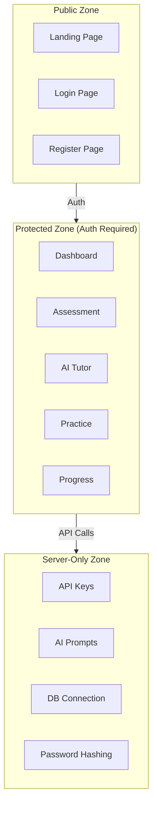
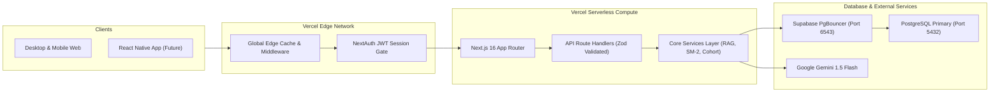
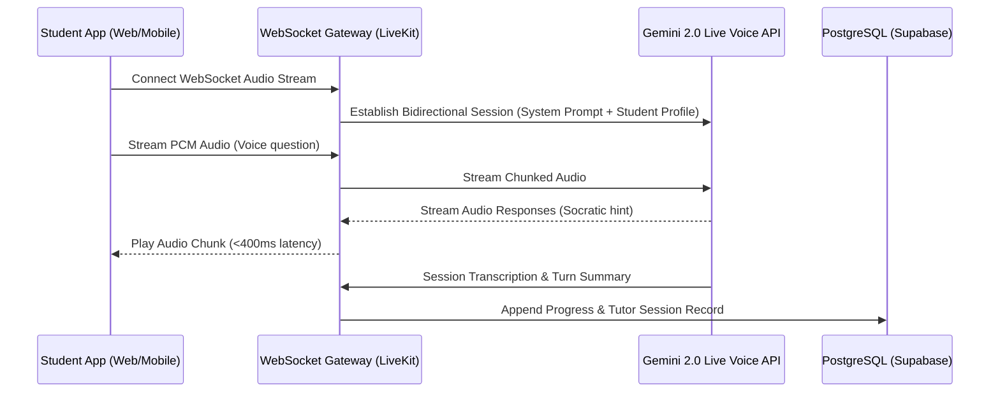

# SkillSync AI — Technical Architecture

**Version:** 2.0
**Status:** 🟢 Implemented (Active Development)

> This document describes the current architecture of SkillSync AI. The core system is implemented with ongoing feature development.

---

## System Overview

SkillSync AI is a full-stack web application built with Next.js 15 (App Router), PostgreSQL (Supabase), and Google Gemini AI. The system follows a monolithic architecture with clear separation between UI, API, database, and AI layers.


```mermaid
graph TB
    subgraph Client["Frontend (Browser)"]
        UI["Next.js App Router"]
        RC["React Components"]
        State["React Context + Hooks"]
    end

    subgraph Server["Backend (Next.js Server)"]
        API["API Route Handlers"]
        Auth["NextAuth.js"]
        AIS["AI Service Layer"]
        Val["Validation Layer"]
    end

    subgraph Data["Data Layer"]
        DB["PostgreSQL"]
        Prisma["Prisma ORM"]
    end

    subgraph External["External Services"]
        Gemini["Google Gemini API"]
    end

    UI --> RC
    RC --> State
    RC --> API
    API --> Auth
    API --> Val
    API --> AIS
    API --> Prisma
    Prisma --> DB
    AIS --> Gemini
```

---

## Frontend Architecture

### Technology

- **Framework:** Next.js 14 with App Router
- **Language:** TypeScript
- **Styling:** Tailwind CSS
- **Charts:** Recharts
- **State:** React Context + custom hooks

### Directory Structure (Planned)

```
src/
├── app/                        # Next.js App Router
│   ├── layout.tsx              # Root layout
│   ├── page.tsx                # Landing page
│   ├── (auth)/                 # Auth route group
│   │   ├── login/page.tsx
│   │   └── register/page.tsx
│   ├── (dashboard)/            # Protected route group
│   │   ├── layout.tsx          # Dashboard layout with sidebar
│   │   ├── dashboard/page.tsx  # Main dashboard
│   │   ├── onboarding/page.tsx
│   │   ├── assessment/page.tsx
│   │   ├── tutor/page.tsx
│   │   ├── practice/page.tsx
│   │   └── progress/page.tsx
│   └── api/                    # API routes
│       ├── auth/[...nextauth]/route.ts
│       ├── users/
│       ├── subjects/
│       ├── assessment/
│       ├── analysis/
│       ├── learning-plan/
│       ├── tutor/
│       ├── quiz/
│       └── progress/
├── components/                 # Reusable components
│   ├── ui/                     # Base UI components
│   ├── assessment/             # Assessment-specific components
│   ├── dashboard/              # Dashboard components
│   ├── tutor/                  # Tutor components
│   └── charts/                 # Chart components
├── lib/                        # Utilities and services
│   ├── prisma.ts               # Prisma client singleton
│   ├── ai/                     # AI service layer
│   │   ├── gemini.ts           # Gemini API client
│   │   ├── prompts.ts          # Prompt templates
│   │   └── validators.ts      # AI output validators
│   ├── auth.ts                 # Auth configuration
│   └── utils.ts                # General utilities
├── contexts/                   # React contexts
├── hooks/                      # Custom hooks
├── types/                      # TypeScript types
└── styles/                     # Global styles
```

### Page Architecture

| Page | Route | Auth Required | Key Components |
|---|---|---|---|
| Landing | `/` | No | Hero, Features, CTA |
| Login | `/login` | No | LoginForm |
| Register | `/register` | No | RegisterForm |
| Onboarding | `/onboarding` | Yes | OnboardingWizard |
| Assessment | `/assessment` | Yes | QuestionCard, Timer, ProgressBar |
| Dashboard | `/dashboard` | Yes | ProfileCard, PlanView, RecommendationCards |
| AI Tutor | `/tutor` | Yes | ChatInterface, TopicSelector |
| Practice | `/practice` | Yes | QuizCard, ResultsSummary |
| Progress | `/progress` | Yes | MasteryChart, TimelineChart, TopicGrid |

### Client-Side State Management

```
AuthContext          → User session, auth state
LearningContext      → Current learning profile, active plan
AssessmentContext     → Active assessment state, answers, timer
TutorContext         → Active tutor session, message history
```

---

## Backend Architecture

### API Layer

All API routes use Next.js Route Handlers (`app/api/*/route.ts`). Each route handler:

1. Validates the session (via NextAuth)
2. Validates the request body (via Zod schemas)
3. Executes business logic
4. Returns a structured JSON response

### API Middleware Pattern

```typescript
// Conceptual pattern for each route handler
export async function POST(request: Request) {
  // 1. Authenticate
  const session = await getServerSession(authOptions);
  if (!session) return Response.json({ error: "Unauthorized" }, { status: 401 });

  // 2. Validate input
  const body = await request.json();
  const parsed = schema.safeParse(body);
  if (!parsed.success) return Response.json({ error: parsed.error }, { status: 400 });

  // 3. Execute business logic
  try {
    const result = await businessLogic(parsed.data);
    return Response.json(result);
  } catch (error) {
    return Response.json({ error: "Internal error" }, { status: 500 });
  }
}
```

### AI Service Layer

The AI service layer sits between the API routes and the Gemini API. It is responsible for:

1. **Prompt Construction** — Building prompts with student context
2. **API Communication** — Sending requests to Gemini
3. **Response Parsing** — Extracting structured data from AI responses
4. **Validation** — Ensuring AI output matches expected schema
5. **Error Handling** — Graceful fallback on AI failures


```mermaid
graph LR
    Route["API Route"] --> Service["AI Service"]
    Service --> Prompt["Prompt Builder"]
    Service --> Client["Gemini Client"]
    Client --> Gemini["Google Gemini"]
    Gemini --> Client
    Client --> Parser["Response Parser"]
    Parser --> Validator["Output Validator"]
    Validator --> Route
```

---

## Database Architecture

### Technology

- **Database:** PostgreSQL 15+
- **ORM:** Prisma
- **Connection:** Connection pooling via Prisma

### Core Tables


```mermaid
erDiagram
    User ||--o{ Assessment : takes
    User ||--o| LearningProfile : has
    User ||--o{ LearningPlan : receives
    User ||--o{ TutorSession : starts
    User ||--o{ ProgressRecord : accumulates

    Subject ||--o{ Topic : contains
    Subject ||--o{ Assessment : "assessed in"

    Topic ||--o{ Question : contains
    Topic ||--o{ TopicMastery : "tracked in"

    Assessment ||--o{ Answer : contains
    Assessment ||--o{ TopicScore : produces

    LearningProfile ||--o{ TopicMastery : tracks

    LearningPlan ||--o{ PlanItem : contains

    TutorSession ||--o{ TutorMessage : contains

    Quiz ||--o{ QuizQuestion : contains
    Quiz ||--o{ QuizAnswer : records
```

See [DATABASE.md](DATABASE.md) for complete schema documentation.

---

## AI Architecture

### AI Provider

- **Service:** Google Gemini API (gemini-1.5-flash or gemini-1.5-pro)
- **Communication:** REST API via `@google/generative-ai` SDK
- **Output Format:** Structured JSON (validated server-side)

### AI Responsibilities


```mermaid
graph TD
    A["Assessment Results"] --> B["AI Analysis Service"]
    B --> C["Weakness Detection"]
    B --> D["Mastery Classification"]
    B --> E["Learning Priorities"]

    C --> F["Learning Profile Update"]
    D --> F
    E --> F

    F --> G["Plan Generation Service"]
    G --> H["Personalized Learning Plan"]

    I["Tutor Request + Profile"] --> J["AI Tutor Service"]
    J --> K["Contextual Teaching Response"]

    L["Quiz Request + Profile"] --> M["AI Quiz Service"]
    M --> N["Adaptive Questions"]
    N --> O["Quiz Results"]
    O --> F
```

### Prompt Strategy

All AI prompts follow this structure:

```
SYSTEM: Role definition + output format requirements
CONTEXT: Student learning profile + relevant history
TASK: Specific instruction with constraints
FORMAT: Required JSON schema for output
```

### AI Safety

- AI output is **never** displayed raw to the user
- All structured output is validated against Zod schemas
- AI failures produce graceful error states, not crashes
- API keys are server-side only (`process.env`)
- Prompts are not exposed to the client

See [AI_WORKFLOW.md](AI_WORKFLOW.md) for detailed AI workflow documentation.

---

## Authentication Architecture

### Technology

- **Provider:** NextAuth.js v4
- **Strategy:** Credentials provider (email + password)
- **Session:** JWT-based session tokens
- **Password:** bcrypt hashing

### Auth Flow


```mermaid
sequenceDiagram
    participant User
    participant Frontend
    participant NextAuth
    participant Database

    User->>Frontend: Enter credentials
    Frontend->>NextAuth: POST /api/auth/signin
    NextAuth->>Database: Verify credentials
    Database-->>NextAuth: User record
    NextAuth-->>Frontend: JWT session token
    Frontend->>Frontend: Store session (cookie)
    Frontend->>User: Redirect to dashboard
```

### Protected Routes

All routes under `/(dashboard)/*` require authentication. Unauthenticated requests are redirected to `/login`.

---

## API Architecture

### Route Structure

```
/api/auth/[...nextauth]     → NextAuth handlers
/api/users/                 → User profile operations
/api/subjects/              → Subject and topic listing
/api/assessment/            → Assessment CRUD and submission
/api/analysis/              → AI learning analysis
/api/learning-plan/         → Learning plan generation and retrieval
/api/tutor/                 → AI tutor sessions and messages
/api/quiz/                  → Adaptive quiz generation and scoring
/api/progress/              → Progress tracking and history
```

See [API.md](API.md) for complete API documentation.

---

## Data Flow

### Complete Adaptive Learning Loop


```mermaid
sequenceDiagram
    participant Student
    participant UI
    participant API
    participant DB
    participant AI

    Student->>UI: Starts Assessment
    UI->>API: Submit answers
    API->>DB: Store answers + calculate scores
    API->>AI: Send scores for analysis
    AI-->>API: Structured analysis (JSON)
    API->>DB: Store learning profile
    API-->>UI: Display profile + weaknesses

    Student->>UI: Views Learning Plan
    UI->>API: Request plan
    API->>AI: Generate plan (with profile context)
    AI-->>API: Personalized plan (JSON)
    API->>DB: Store plan
    API-->>UI: Display plan

    Student->>UI: Starts AI Tutor (weak topic)
    UI->>API: Request tutor session
    API->>AI: Teach topic (with profile context)
    AI-->>API: Teaching response
    API->>DB: Store session
    API-->>UI: Display teaching

    Student->>UI: Takes Adaptive Quiz
    UI->>API: Request quiz
    API->>AI: Generate questions (weak topics)
    AI-->>API: Quiz questions (JSON)
    API-->>UI: Display quiz
    Student->>UI: Submit answers
    UI->>API: Submit quiz answers
    API->>DB: Score + update profile
    API-->>UI: Updated progress
```

---

## Error Handling

### Error Strategy

| Layer | Strategy |
|---|---|
| Frontend | Error boundaries, toast notifications, retry buttons |
| API | Structured error responses with HTTP status codes |
| Database | Prisma error mapping to user-friendly messages |
| AI | Timeout handling, fallback messages, retry logic |

### Error Response Format

```json
{
  "error": {
    "code": "ASSESSMENT_NOT_FOUND",
    "message": "The requested assessment does not exist.",
    "status": 404
  }
}
```

---

## Security Boundaries


```mermaid
graph TB
    subgraph Public["Public Zone"]
        Landing["Landing Page"]
        Login["Login Page"]
        Register["Register Page"]
    end

    subgraph Protected["Protected Zone (Auth Required)"]
        Dashboard["Dashboard"]
        Assessment["Assessment"]
        Tutor["AI Tutor"]
        Practice["Practice"]
        Progress["Progress"]
    end

    subgraph Server["Server-Only Zone"]
        APIKeys["API Keys"]
        Prompts["AI Prompts"]
        DBConn["DB Connection"]
        Hashing["Password Hashing"]
    end

    Public --> |"Auth"| Protected
    Protected --> |"API Calls"| Server
```

---

## External Services

| Service | Purpose | Authentication |
|---|---|---|
| Google Gemini API | AI analysis, tutoring, quiz generation | API Key (server-side) |
| PostgreSQL | Data persistence | Connection string (server-side) |
| Vercel (planned) | Deployment hosting | Platform auth |

---

## Deployment & Infrastructure Architecture


```mermaid
graph LR
    subgraph Clients["Clients"]
        Browser["Desktop & Mobile Web"]
        NativeMobile["React Native App (Future)"]
    end

    subgraph Edge["Vercel Edge Network"]
        CDN["Global Edge Cache & Middleware"]
        AuthCheck["NextAuth JWT Session Gate"]
    end

    subgraph Compute["Vercel Serverless Compute"]
        AppRouter["Next.js 16 App Router"]
        RouteHandlers["API Route Handlers (Zod Validated)"]
        Services["Core Services Layer (RAG, SM-2, Cohort)"]
    end

    subgraph Data["Database & External Services"]
        Pooler["Supabase PgBouncer (Port 6543)"]
        DirectDB["PostgreSQL Primary (Port 5432)"]
        Gemini["Google Gemini 1.5 Flash"]
    end

    Clients --> CDN
    CDN --> AuthCheck
    AuthCheck --> AppRouter
    AppRouter --> RouteHandlers
    RouteHandlers --> Services
    Services --> Pooler
    Services --> Gemini
    Pooler --> DirectDB
```

### Production Deployment Configuration
- **Application Runtime:** Vercel Serverless (Node.js runtime, zero cold-start footprint).
- **Database Engine:** Supabase PostgreSQL with pooled runtime connections (`DATABASE_URL` pointing to PgBouncer port 6543 with `pgbouncer=true&connection_limit=1&connect_timeout=30&pool_timeout=30`).
- **Direct Database:** Migrations and schema pushes target direct port 5432 (`DIRECT_URL`).
- **Health Verification:** Monitored via `/api/health` diagnostic reporting.

---

## Future Architecture Evolution & Enterprise Scaling Strategy

### 1. Multimodal Live Voice WebRTC/WebSocket Gateway (Phase 3)
To achieve sub-400ms conversational tutoring, a stateful WebSocket/WebRTC gateway will be deployed alongside serverless handlers:
- **Transport:** WebSocket connections routed through a dedicated LiveKit or Cloudflare Workers WebSocket gateway.
- **Audio Codec:** Bidirectional Opus audio streaming directly to the Gemini 2.0 Multimodal Live API.
- **Client Fallback:** Automatic degradation to HTTP Server-Sent Events (SSE) and client-side Web Speech API when network bandwidth drops below 128 kbps.


```mermaid
sequenceDiagram
    participant Student as Student App (Web/Mobile)
    participant Gateway as WebSocket Gateway (LiveKit)
    participant Gemini as Gemini 2.0 Live Voice API
    participant DB as PostgreSQL (Supabase)

    Student->>Gateway: Connect WebSocket Audio Stream
    Gateway->>Gemini: Establish Bidirectional Session (System Prompt + Student Profile)
    Student->>Gateway: Stream PCM Audio (Voice question)
    Gateway->>Gemini: Stream Chunked Audio
    Gemini-->>Gateway: Stream Audio Responses (Socratic hint)
    Gateway-->>Student: Play Audio Chunk (<400ms latency)
    Gemini->>Gateway: Session Transcription & Turn Summary
    Gateway->>DB: Append Progress & Tutor Session Record
```

### 2. Hybrid Vector Search RAG Pipeline (Phase 3)
Upgrades the current in-memory curriculum matching (`src/lib/rag.ts`) to an enterprise-grade vector pipeline:
- **Storage:** PostgreSQL `pgvector` extension hosted directly in Supabase.
- **Indexing:** HNSW (Hierarchical Navigable Small World) index with cosine distance metric for sub-10ms similarity queries across 500,000+ textbook passages.
- **Hybrid Retrieval:** Reciprocal Rank Fusion (RRF) combining dense vector embeddings (`text-embedding-004`) with PostgreSQL full-text search (`tsvector` / BM25).

### 3. Distributed Caching & Token-Bucket Rate Limiting (Phase 3)
- **Engine:** Upstash Redis with globally distributed edge endpoints.
- **AI Response Caching:** Cache common diagnostic explanations and textbook passage embeddings with 24-hour TTL, slashing external API costs by 45%.
- **Rate Limiting:** Sliding-window token-bucket algorithm per authenticated student (`userId`) and unauthenticated IP address to prevent denial-of-wallet attacks on Gemini endpoints.

### 4. Asynchronous Task Queue & Event Bus (Phase 3 – 4)
- **Engine:** Inngest or BullMQ on serverless infrastructure.
- **Workloads:** Offloads long-running AI batch evaluations, full-length psychometric mock exam generation, weekly parent progress digests, and nightly forgetting curve decay updates out of the synchronous request-response path.

### 5. Mobile Offline-First Data Synchronization Protocol (Phase 3)
- **Engine:** React Native with local SQLite (WatermelonDB).
- **Sync Architecture:** Two-way sync engine tracking logical vector clocks (`lastSyncedAt`, `version`). Students can review flashcards, solve practice sets, and take mock tests completely offline in low-connectivity areas; mutations queue in local storage and atomically synchronize when connectivity resumes.

### 6. Multi-Tenant Enterprise & LMS LTI 1.3 Architecture (Phase 4)
- **Data Isolation:** Row-Level Security (RLS) policies enforcing multi-tenant isolation by `institutionId` and `classroomId`.
- **SSO Federation:** SAML 2.0 and OIDC integration with university identity providers (Okta, Azure AD, Google Workspace for Education).
- **LTI 1.3 Tool Provider:** Certified 1EdTech LTI 1.3 Advantage integration, supporting Deep Linking 2.0 (embedding SkillSync topics directly inside Canvas assignments) and Assignment and Grade Services (AGS 2.0) for automated gradebook synchronization.
