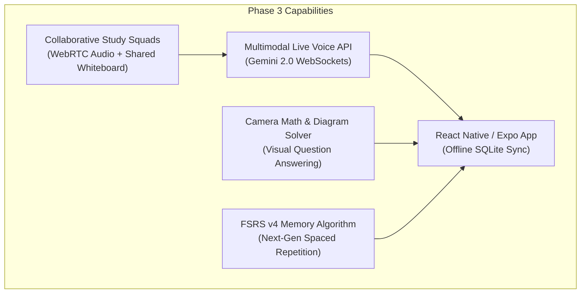
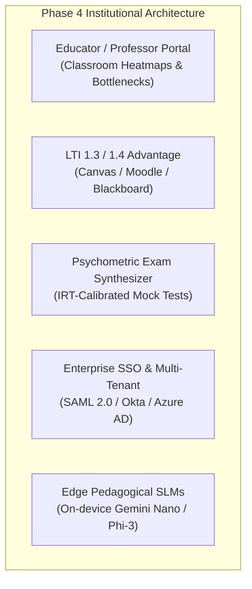

# SkillSync AI — Development Roadmap, Status & Future Vision

**Version:** 0.4.0  
**Last Updated:** September 2026  
**Overall Status:** 🟢 Core Adaptive Loop Complete — Scaling to Multimodal & Institutional Learning  

> This document is the single authoritative source of truth for implementation status, future feature specifications, and architectural release history.

---

## 1. Project Implementation Status

### Status Legend
- `[x]` Completed & Verified
- `[~]` In Active Development
- `[ ]` Future Roadmap Milestone
- `[!]` Blocked / Under Review

### Core Capabilities Progress Matrix

| Component | Status | Verified Capabilities |
|---|:---:|---|
| **Project Setup & Architecture** | `[x]` | Next.js 16 (App Router), React 19, TypeScript 5 (Strict), Tailwind CSS v4, Lucide React |
| **Database & Connection Pooling** | `[x]` | PostgreSQL via Supabase, Prisma ORM singleton, PgBouncer pooler (port 6543) serverless tuning |
| **Authentication System** | `[x]` | Dual-layer: Supabase Auth (`admin.createUser` / `signInWithPassword`) + NextAuth JWT sessions |
| **Registration & Login Pages** | `[x]` | Client forms with exponential retries, structured error handling (`400`, `409`, `503`), demo login |
| **Global Active Subject Track** | `[x]` | 6 Curriculum tracks (Python, Maths, DBMS, OS, CN, DSA), quick switcher in header & sidebar, profile sync |
| **Landing Page & Micro-Interactions** | `[x]` | Hero section, animated feature cards, bilingual EN/HI toggle, contrast mode, responsive design |
| **Student Onboarding Flow** | `[x]` | Multi-step wizard: education level, exam goals, primary subject track selection |
| **Diagnostic Assessment Engine** | `[x]` | Timed 5-question adaptive assessment, zero-leak question delivery, server-side scoring |
| **AI Learning Analysis** | `[x]` | Gemini AI engine, structured output with Zod validation, prerequisite gap detection |
| **Assessment Results & Mastery HUD** | `[x]` | Topic-level mastery scoring (Weak <40%, Medium 40-70%, Strong >70%) with direct analysis links |
| **Contextual Socratic AI Tutor** | `[x]` | Context injection (education level, goal, mastery), Socratic hints, STT voice input, audio TTS |
| **Session Summarization** | `[x]` | `/api/tutor/summarize` generates Markdown study notes (Key Concepts, Formulas, Pitfalls, Practice) |
| **Targeted Smart Practice & Quizzes** | `[x]` | Adaptive difficulty scaling (easy ↔ medium ↔ hard), closed-loop profile mastery recalculation |
| **Spaced Repetition (SM-2) Engine** | `[x]` | Ebbinghaus forgetting curve modeling, retention risk classification (low/medium/critical) |
| **Cohort Analytics & Bottleneck Prediction** | `[x]` | Real-time bottleneck detection benchmarked against cohort historical data |
| **Interactive Skill Knowledge Graph** | `[x]` | Interactive Canvas/SVG topic dependency graph with real-time mastery nodes across all tracks |
| **Health Monitoring & Diagnostics** | `[x]` | `/api/health` endpoint with environment & database status reporting |
| **Automated Verification Pipeline** | `[x]` | Script-based diagnostic tests in `scripts/verify-learning-loop.ts` (6/6 passing) |

---

## 2. Four-Phase Development Roadmap

### Phase 1 — Core Adaptive Loop ✅ (100% Completed)
**Goal:** Deliver the full end-to-end adaptive learning cycle from assessment to personalized tutoring.  
- [x] Next.js 16 + React 19 + Tailwind v4 foundational setup
- [x] Dual-layer auth (Supabase Auth + NextAuth credentials provider)
- [x] Seed data curation across 6 engineering tracks (Python, Maths, DBMS, OS, CN, DSA)
- [x] Diagnostic assessment engine with strict server-side answer evaluation
- [x] Gemini AI learning analysis and structured Zod parsing
- [x] Dynamic mastery profile generation and append-only `ProgressRecord` persistence
- [x] Socratic AI Tutor with context injection and speech-to-text / text-to-speech

### Phase 2 — Hackathon Polish & Intelligent Automation ✅ (100% Completed)
**Goal:** Production hardening, advanced heuristics, and high-concurrency readiness.  
- [x] High-converting landing page with animated hero, live demo preview, and accessibility modes
- [x] Multi-track switcher dropdown in header and layout sidebar without container clipping
- [x] RAG curriculum grounding service (`src/lib/rag.ts`) for textbook-anchored responses
- [x] Spaced repetition engine (`src/lib/spacedRepetition.ts`) implementing SuperMemo SM-2
- [x] Cohort bottleneck prediction engine (`src/lib/cohortAnalytics.ts`)
- [x] Production PgBouncer pooler optimization (`connection_limit=1&connect_timeout=30&pool_timeout=30`)
- [x] High-contrast accessibility theme and bilingual English / Hindi UI toggles

---

### Phase 3 — Multimodal AI & Mobile Ecosystem 🔮 (Target: Q1 – Q3 2027)

**Goal:** Transform SkillSync from a text-first web platform into an ambient, multimodal, mobile-first learning companion.

| # | Milestone | Detailed Specification | Target | Priority |
|---|---|---|:---:|:---:|
| 3.1 | **Bidirectional Live Voice Tutor** | Integration of Gemini Multimodal Live API over WebSockets. Enables low-latency (<400ms), interruptible voice dialogue with realistic emotion and natural pacing in English, Hindi, Hinglish, Tamil, and Telugu. | Q1 2027 | P0 |
| 3.2 | **Multimodal Vision Problem Solver** | "Snap & Solve" camera scanner for complex STEM topics: parses handwritten math equations, circuit diagrams, and ER schemas using Gemini Vision; generates step-by-step Socratic probing questions rather than answers. | Q1 2027 | P0 |
| 3.3 | **Cross-Platform Mobile App (iOS & Android)** | Built with React Native & Expo. Features offline-first study decks using local SQLite/WatermelonDB, seamless cloud sync, lock-screen interactive flashcards, and native haptic feedback. | Q2 2027 | P1 |
| 3.4 | **FSRS v4 Memory Algorithm Upgrade** | Upgrade from SuperMemo SM-2 to Free Spaced Repetition Scheduler (FSRS v4). Calibrates individual memory stability ($S$) and retrievability ($R$) curves to reduce review time by 30% while maintaining 90% retention. | Q2 2027 | P1 |
| 3.5 | **Collaborative Live Study Squads** | Real-time virtual study rooms powered by LiveKit / WebRTC. Students work on shared problem sets, collaborate on interactive whiteboard canvas, and consult a shared Socratic AI bot in real time. | Q3 2027 | P2 |
| 3.6 | **Gamification & Mastery Quests** | Weekly study streaks, XP multipliers, proof-of-mastery digital achievement badges (NFT/Verifiable Credentials), and opt-in college cohort leaderboards. | Q3 2027 | P2 |

---

### Phase 4 — Institutional Enterprise & Educator Intelligence 🚀 (Target: Q3 2027 – 2028)

**Goal:** Expand into accredited universities, coaching institutes, and enterprise edtech environments.

| # | Milestone | Detailed Specification | Target | Priority |
|---|---|---|:---:|:---:|
| 4.1 | **Educator & Professor Dashboard** | Comprehensive class-level intelligence dashboard. Professors view aggregate student knowledge graphs, identify systemic prerequisite bottlenecks before midterms, and auto-dispatch targeted practice sets. | Q3 2027 | P0 |
| 4.2 | **LTI 1.3 / 1.4 Advantage LMS Standard** | Seamless deep-linking and grade passback for Canvas, Blackboard, Moodle, and Google Classroom. Allows instructors to embed SkillSync adaptive modules into existing LMS syllabi. | Q4 2027 | P1 |
| 4.3 | **Psychometric Mock Exam Synthesizer** | Automated full-length exam generator calibrated to standardized exam patterns (e.g. GATE CS, JEE, University finals). Employs Item Response Theory (IRT) to estimate exact student percentile and score bands. | Q4 2027 | P1 |
| 4.4 | **Enterprise Multi-Tenant Isolation & SSO** | University-wide deployments featuring SAML 2.0, Okta, and Azure AD single sign-on. Strict tenant data segregation, SOC2 compliance controls, and student privacy sandboxing (FERPA / GDPR-K). | 2028 | P1 |
| 4.5 | **Local Edge SLM Deployment** | Fallback to high-performance Small Language Models (Gemini Nano, Microsoft Phi-3, Qwen 2.5) running locally via WebGPU/ONNX for low-latency, zero-cost, private offline tutoring. | 2028 | P2 |
| 4.6 | **Curriculum Knowledge Marketplace** | Educator authoring studio enabling domain experts and professors to upload custom syllabus packs, proprietary textbook passages, and calibrated question banks. | 2028 | P3 |

---

## 3. Technical Infrastructure Evolution

| Infrastructure Area | Current State | Future Architecture (Phase 3 & 4) | Target Milestone |
|---|---|---|:---:|
| **Caching Layer** | In-memory & Next.js cache | Upstash Redis distributed caching for AI analysis, session states, and rate limits | Q1 2027 |
| **Real-time Transport** | Server-Sent Events / HTTP polling | WebSocket & WebRTC gateway (LiveKit / Supabase Realtime) for voice and study rooms | Q1 2027 |
| **Vector Search & RAG** | In-memory keyword & passage search | PostgreSQL `pgvector` with HNSW indexing and hybrid semantic/lexical BM25 search | Q2 2027 |
| **Asynchronous Task Queue** | Direct API route processing | Inngest / BullMQ distributed serverless queue for heavy exam analysis and email digests | Q2 2027 |
| **Telemetry & Observability** | Console & `/api/health` | OpenTelemetry + Datadog / Sentry performance monitoring and LLM token tracing | Q1 2027 |
| **End-to-End Verification** | TypeScript + custom scripts | Playwright automated cross-browser test suite integrated into GitHub Actions CI/CD | Q1 2027 |

---

## 4. Project Release Changelog

### [0.4.0] — September 2026 (Current)
#### Added & Fixed
- **Multi-Subject Track Selector Fix**: Fixed dropdown menu clipping in [ActiveSubjectHeader.tsx](file:///c:/Users/ABHI%20SHARMA/OneDrive/Desktop/SkillSync/src/components/ActiveSubjectHeader.tsx) by removing `overflow-hidden` from outer card and isolating the ambient glow into an inner container. All 6 curriculum tracks (Python, Maths, DBMS, OS, CN, DSA) are now visible and selectable with smooth scrolling.
- **Sidebar Dropdown Outside Click**: Added outside click ref handler and scrollable constraints in [AppLayout.tsx](file:///c:/Users/ABHI%20SHARMA/OneDrive/Desktop/SkillSync/src/components/AppLayout.tsx).
- **Profile Guidance Update**: Enhanced guidance tip in [profile/page.tsx](file:///c:/Users/ABHI%20SHARMA/OneDrive/Desktop/SkillSync/src/app/profile/page.tsx) to clarify global subject switching across headers, sidebar, and profile.
- **Documentation Suite Modernization**: Updated entire roadmap, PRD, architecture, and API documentation to reflect completed adaptive loop features and articulate Phase 3 & Phase 4 future milestones.

### [0.3.0] — September 2026
#### Added & Improved
- **Knowledge Graph**: Interactive topic dependency network visualization across curriculum tracks.
- **Contextual AI Coach**: Multi-step Socratic tutor with prerequisite gap guidance and audio speech capabilities.
- **Spaced Repetition & Cohort Analytics**: Initial rollout of SM-2 forgetting curve calculation and bottleneck forecasting.
- **Health Check Diagnostics**: `/api/health` endpoint for production environment inspection.

### [0.2.0] — September 2026
#### Added & Fixed
- **Supabase Authentication**: Integrated `@supabase/supabase-js` dual-layer auth with NextAuth JWT sessions.
- **Serverless PgBouncer Pooler**: Enforced port 6543 connection parameters for Vercel production deployment.
- **Resilient Registration**: Added exponential retry logic with HTTP 400, 409, 500, and 503 error envelopes.

### [0.1.0] — Initial Release
- Baseline App Router setup, Prisma PostgreSQL schema, and seed data.
